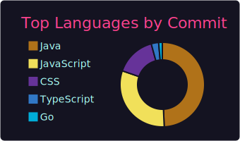

# Hi there 👋

Welcome to my GitHub profile! I'm passionate about building projects that showcase my skills and serve as a portfolio for my career goals.

### 📊 My GitHub Stats (Includes Private Repos)

  
  

  

---

### 👨‍💻 About Me
- 🎓 Currently studying at **NIT Durgapur**.
- 🛠 Working on personal projects to enhance my CV and develop my expertise in various areas of software development.
- 🚀 Skilled in **Java**, **Spring Boot**, **JavaScript**, **HTML**, **React.js**, **Node.js**, **MERN stack**, and **Next.js**.

---

### 📫 How to Reach Me
Feel free to reach out via [LinkedIn](https://www.linkedin.com/in/arkaprava-dhar-41b9b0279/) or by opening an issue here on GitHub.

Thank you for visiting! 😊
